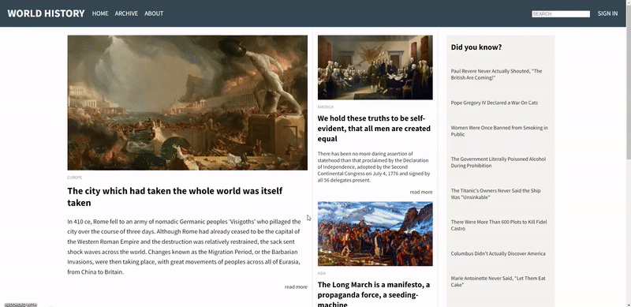

# Web-Blog
This project is part of Udacity Front End Web Developer Nanodegree Program.

The goal is learn and practice how to make <em>css gird</em> and <em>css flexbox</em>.

<b>Link : </b>
https://thasup.github.io/My-Web-Blog/
